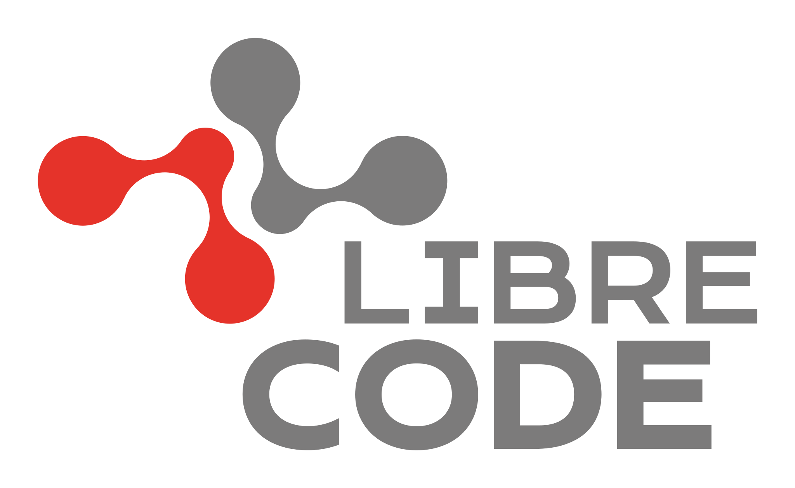

<!--
SPDX-FileCopyrightText: 2026 LibreCode Coop contributors
SPDX-License-Identifier: CC-BY-SA-4.0
-->

  

# LibreCode brand

Canonical, version-controlled source for the current LibreCode brand system.

Public guide: https://librecode.coop/brand

Latest homologation manual: https://github.com/LibreCodeCoop/brand/releases/download/latest/librecode-brand-manual.pdf

## Contract

- This repository contains the **current** brand system.
- Canonical artwork lives under `source/artwork/`.
- PNG/PDF derivatives are generated from canonical SVG source by CI.
- The repository-level `LICENSE` is **CC BY-SA 4.0**, the primary license for documentation and official artwork.
- Build scripts and automation are licensed under **AGPL-3.0-or-later**.
- Third-party fonts keep their upstream licenses.
- Per-file SPDX metadata and `LICENSES/` remain authoritative where a file uses a different license.
- Trademark permission is governed separately by `TRADEMARKS.md`.

## Layout

- `guidelines/` — normative brand rules.
- `source/artwork/` — canonical editable artwork.
- `assets/` — asset distribution policy.
- `manual/` — Typst source.
- `docs/` — architecture, decisions, references, and the LibreCode completion plan.
- `LICENSES/` and `REUSE.toml` — licensing metadata.

## Completion plan

The implementation checklist distilled from the completed LibreSign brand work is documented in [`docs/libresign-parity-plan.md`](docs/libresign-parity-plan.md). Use it as the engineering and quality baseline while keeping all LibreCode-specific brand decisions independent.

## Publication status

The `latest` release is a mutable **homologation build** generated from `main`. It is intentionally not a stable versioned release and may change whenever the brand source changes.

The first stable versioned release will only be created after external review and explicit approval.
